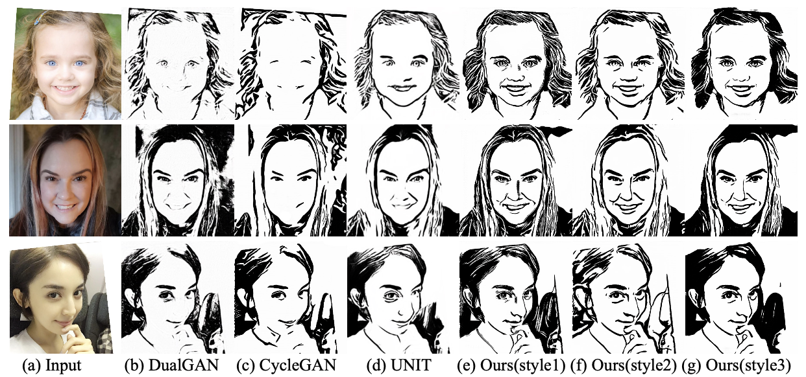

# Quality Metric Guided Portrait Line Drawing Generation from Unpaired Training Data

We provide PyTorch implementations for our TPAMI paper "Quality Metric Guided Portrait Line Drawing Generation from Unpaired Training Data". [paper](https://ieeexplore.ieee.org/document/9699090)

Our method can (1) learn to generate high quality portrait drawings in multiple styles using a single network and (2) generate portrait drawings in a “new style” unseen in the training data.


## Our Proposed Framework
 


## Sample Results



## Prerequisites
- Linux or macOS
- Python 3
- CPU or NVIDIA GPU + CUDA CuDNN

## Installation
- To install the dependencies, run
```bash
pip install -r requirements.txt
```

## Quick Test (apply a pretrained model, generate high quality portrait drawings in multiple styles using a single network)

- 1. Download pre-trained models from [BaiduYun](https://pan.baidu.com/s/1_9Fy8mRpTQp6AvqhHsfQAQ)(extract code:c9h7) or [GoogleDrive](https://drive.google.com/drive/folders/1FzOcdlMYhvK_nyLCe8wnwotMphhIoiYt?usp=sharing) and rename the folder to `checkpoints/`.

- 2. Test for example photos: generate artistic portrait drawings for example photos in the folder `./examples` using
``` bash
python test_seq_style3.py
```
The test results will be saved to html files here: `./results/QMUPD_model/test_200/indexstyle*.html`.
The result images are saved in `./results/QMUPD_model/test_200/imagesstyle*`,
where `real`, `fake`, correspond to input face photo, synthesized drawing of a certain style, respectively.

You can contact email ranyi@sjtu.edu.cn for any questions.


## Citation
If you use this code for your research, please cite our paper.

```
@article{YiLLR22,
  title     = {Quality Metric Guided Portrait Line Drawing Generation from Unpaired Training Data},
  author    = {Yi, Ran and Liu, Yong-Jin and Lai, Yu-Kun and Rosin, Paul L},
  journal   = {IEEE Transactions on Pattern Analysis and Machine Intelligence},
  year      = {DOI (identifier)  10.1109/TPAMI.2022.3147570, 2022},
}
```

## Acknowledgments
Our code is inspired by [pytorch-CycleGAN-and-pix2pix](https://github.com/junyanz/pytorch-CycleGAN-and-pix2pix).
